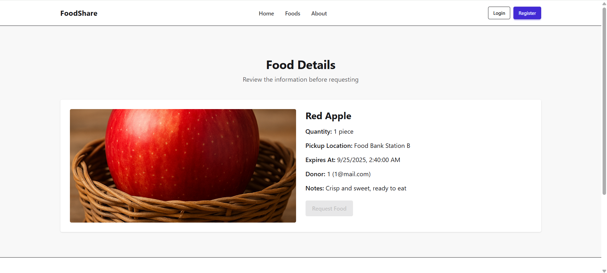

# Food Sharing App — Client Side

## Overview
This is the frontend of the Food Sharing platform built using React and Vite. It allows users to donate food, browse available items, and request food securely.

---

## Live Site

[https://merry-queijadas-9a4f99.netlify.app](https://merry-queijadas-9a4f99.netlify.app)

---

## Purpose

To reduce food waste and connect donors with individuals in need by enabling users to share excess food and allow others to request it.

---

## Key Features

- Firebase authentication (Email & Google)
- JWT token-based secure API communication
- Add, update, and delete donated food items
- View available food with search and sort options
- Request food and view your own requests
- Responsive layout with mobile support
- Protected routes for authenticated users

---

## Tech Stack

- React
- Vite
- React Router
- Tailwind CSS
- DaisyUI
- Firebase Authentication
- TanStack React Query
- SweetAlert2
- motion/react

---

## Screenshots



## Environment Variables

Create a `.env` file in the root of your client project:

VITE_API_BASE_URL=https://b11a11-server-side-tsgm1257.vercel.app

---

## Installation

1. Clone the repository
2. Run `npm install`
3. Add the `.env` file with the correct backend URL
4. Run the app locally:

```
npm run dev
```

---

## Available Scripts

- `npm run dev` — Start the development server
- `npm run build` — Build the project for production
- `npm run preview` — Preview the production build
